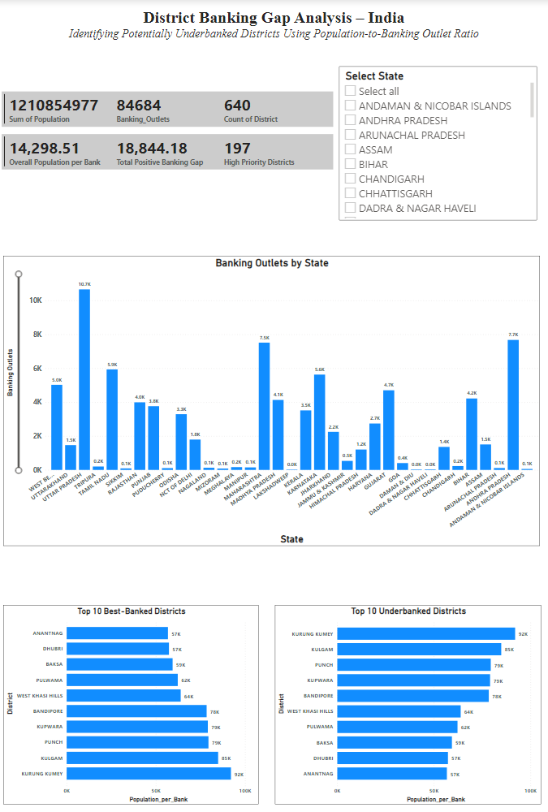
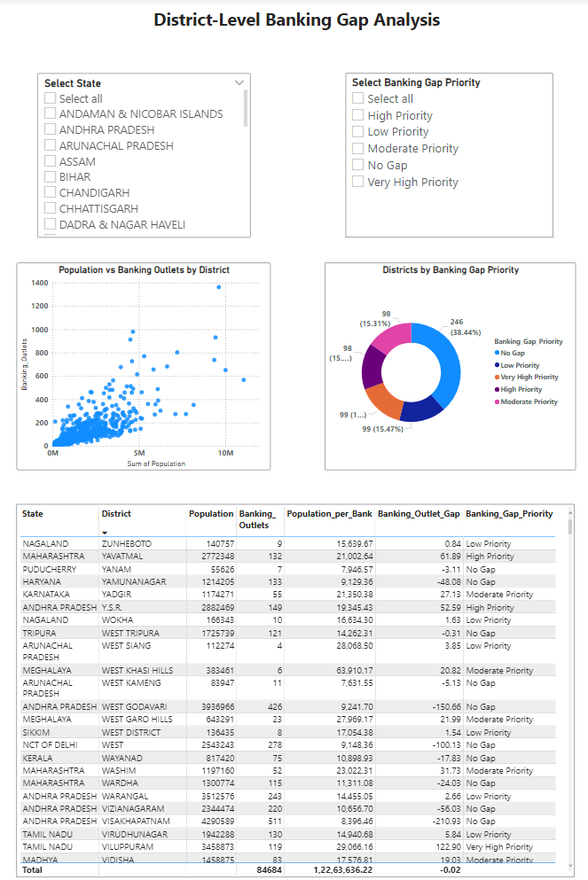

# District Banking Gap Analysis – India

## 📌 Project Overview

The **District Banking Gap Analysis – India** project identifies districts that may have relatively limited banking access by comparing district population with the availability of banking outlets.

The main indicator used in this project is **Population per Banking Outlet**, which measures how many people are associated with each banking outlet in a district.

The project combines **Census 2011 district population data** with **Reserve Bank of India (RBI) banking outlet data** and presents the results through an interactive **Power BI dashboard**.

> **Note:** The analysis identifies *potentially underbanked districts*. It is an analytical indicator and should not be interpreted as a complete measure of financial inclusion.

---

## 🎯 Objectives

* Analyze banking outlet availability at the district level.
* Compare district population with banking outlet availability.
* Identify districts with relatively high population per banking outlet.
* Calculate the expected number of banking outlets using an overall benchmark.
* Identify districts with positive banking outlet gaps.
* Categorize districts according to banking gap priority.
* Build an interactive Power BI dashboard for visualization and analysis.

---

## 📊 Data Sources

The project uses two major data sources:

### 1. Census 2011

District-level population data from the **Census of India 2011**.

### 2. RBI Banking Outlet Data

Banking outlet information obtained from the **Reserve Bank of India (RBI)**.

The RBI data represents current banking outlet information, while population is based on Census 2011 district boundaries. Therefore, district and state names were standardized and mapped where necessary.

---

## 🔄 Data Processing

The data processing was performed using Python.

The major steps were:

1. Clean and validate Census 2011 district population data.
2. Clean RBI banking outlet data.
3. Standardize state and district names.
4. Handle historical and renamed districts.
5. Map RBI districts to the 640 Census 2011 districts.
6. Aggregate banking outlets at the district level.
7. Merge population and banking outlet data.
8. Calculate population per banking outlet.
9. Calculate expected banking outlets.
10. Calculate the banking outlet gap.
11. Assign banking gap priority categories.
12. Validate the final results.

---

## 🧮 Key Calculations

### Population per Banking Outlet

```text
Population per Bank = Population / Banking Outlets
```

A higher value indicates that more people are associated with each banking outlet.

### Overall Benchmark

The overall benchmark is calculated as:

```text
Benchmark Population per Bank =
Total Population / Total Banking Outlets
```

The final benchmark for this analysis is approximately:

```text
14,298.51 people per banking outlet
```

### Expected Banking Outlets

```text
Expected Banking Outlets =
Population / Benchmark Population per Bank
```

### Banking Outlet Gap

```text
Banking Outlet Gap =
Expected Banking Outlets - Actual Banking Outlets
```

A positive gap indicates that a district has fewer banking outlets than expected according to the overall benchmark.

---

## 📈 Final Dataset

The final analysis contains:

* **640 Census 2011 districts**
* **1,210,854,977 total population**
* **84,684 banking outlets included in the final district analysis**
* **14,298.51 overall population-per-banking-outlet benchmark**

The final dataset contains the following important fields:

```text
State
District
Population
Banking_Outlets
Population_per_Bank
Banking_Access_Rank
Banking_Access_Category
Expected_Banking_Outlets
Banking_Outlet_Gap
Banking_Gap_Priority
```

---

## ⚠️ District Mapping and Validation

Because RBI banking outlet data and Census 2011 district boundaries are from different periods, some district names and administrative boundaries do not directly match.

The project therefore performs district and state standardization and mapping.

The final validation resulted in:

```text
Total Census districts: 640
Districts with banking data: 640
Districts with no banking outlets: 0
Remaining unmatched districts: 0
```

A total of **4,044 RBI banking outlets** were excluded from the final 640-district analysis because they belonged to district groupings that could not be reliably mapped to the Census 2011 district boundaries.

This exclusion was separately audited and the exclusion check passed.

---

## 🚦 Banking Gap Priority

The final analysis categorizes districts into five banking gap priority groups:

| Priority           | Number of Districts |
| ------------------ | ------------------: |
| No Gap             |                 246 |
| Low Priority       |                  99 |
| Moderate Priority  |                  98 |
| High Priority      |                  98 |
| Very High Priority |                  99 |

These categories are used to highlight districts that may require greater attention based on the calculated banking outlet gap.

---

## 🏆 Key Findings

Some of the districts identified with high population per banking outlet include:

* Kurung Kumey
* Kulgam
* Punch
* Kupwara
* Bandipore
* West Khasi Hills
* Pulwama
* Baksa
* Dhubri
* Anantnag

The analysis also identifies districts with large positive banking outlet gaps, including:

* Barddhaman
* Murshidabad
* South Twenty Four Parganas
* Purba Champaran
* Thane
* Moradabad
* Madhubani
* Sitapur
* Sultanpur
* Pashchim Champaran

---

## 📊 Power BI Dashboard

The processed datasets are visualized using Microsoft Power BI.

### Page 1 – Main Dashboard

Contains:

* Total Districts
* Total Population
* Total Banking Outlets
* Overall Population per Bank
* Total Positive Banking Gap
* High Priority Districts
* Banking Outlets by State
* Top 10 Underbanked Districts
* Top 10 Best-Banked Districts
* State slicer

#### Dashboard Preview



### Page 2 – District-Level Banking Gap Analysis

Contains:

* State slicer
* Banking Gap Priority slicer
* Population vs Banking Outlets scatter chart
* Districts by Banking Gap Priority
* District-level analysis table

#### Dashboard Preview



## 🛠️ Technologies Used

* Python
* Pandas
* Microsoft Power BI / DAX
* CSV / Excel datasets

---

## 📁 Project Structure

```text
District-Banking-Gap-Analysis/
│
├── poorvi.py
├── README.md
├── .gitignore
│
├── dataa/
│   ├── raw/
│   └── processed/
│
├── images/
│   ├── page1.png
│   └── page2.png
│
└── PowerBI/
    └── District_Banking_Gap_Analysis.pbix
```

---

## 🔍 Project Outcome

This project demonstrates how population data and banking outlet data can be combined to identify **potential district-level banking gaps**.

The analysis provides a data-driven way to compare banking outlet availability across districts and helps highlight areas that may require further investigation from a banking-access perspective.

---

## 👩‍💻 Author

**Poorvi Parab**

AI & Data Science Engineering
Mumbai University
